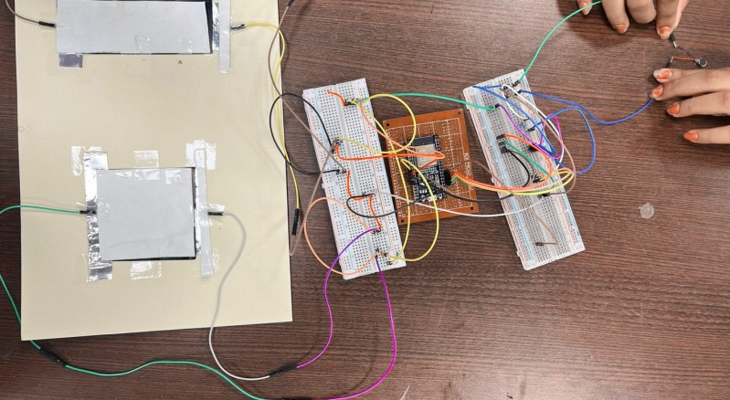
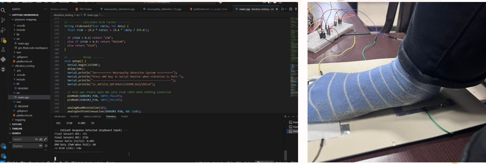
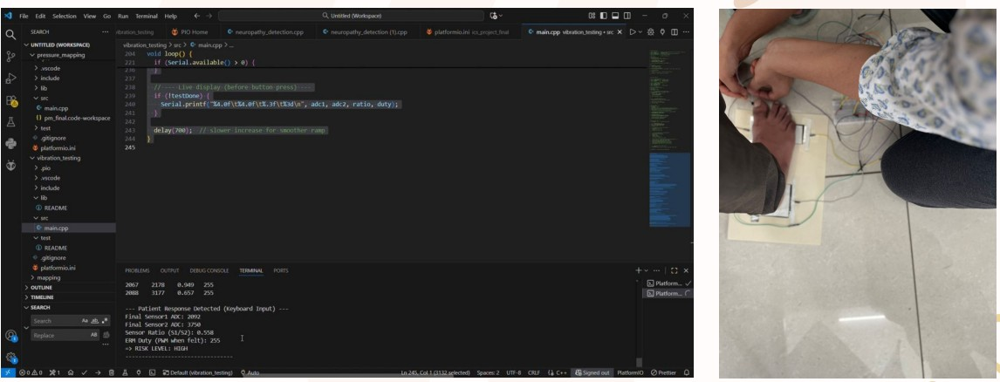

# Early Diabetic Neuropathy Detection via Foot Vibration & Pressure Mapping

## Overview

Diabetic peripheral neuropathy is a common complication of long-term
diabetes that can cause reduced sensation in the feet and abnormal plantar
pressure distribution. These changes can increase the risk of foot ulcers
and other complications.

This project presents a low-cost and portable prototype for early screening
of peripheral neuropathy by combining:

- Vibration Perception Threshold (VPT) testing
- Plantar pressure measurement

The system uses an ESP32-based data-acquisition unit, Velostat pressure
sensors, and an ERM vibration motor to obtain pressure and vibration-related
measurements and provide an experimental risk classification.

The prototype was designed with a target cost of **≤ ₹1000**.

---

## Objectives

- Measure plantar pressure distribution at key regions of the foot.
- Measure Vibration Perception Threshold (VPT).
- Calculate pressure-based indicators such as the pressure ratio.
- Combine pressure and vibration measurements into an experimental risk
  score.
- Develop a low-cost and portable screening prototype.
- Use readily available and affordable electronic components.

---

## System Overview

The prototype combines two complementary measurements.

### 1. Plantar Pressure Measurement

Velostat-based pressure sensors are used to measure changes in plantar
loading.

The sensors are incorporated into voltage-divider circuits and connected
to the analog input pins of the ESP32.

The ESP32 acquires the sensor voltages through its ADC and calculates a
pressure ratio from the sensor readings.

### 2. Vibration Perception Threshold

An ERM (Eccentric Rotating Mass) motor is used to generate vibration
stimuli.

The motor intensity is controlled using PWM. The vibration intensity is
gradually increased until the user reports that the vibration is perceived.

The corresponding PWM value is recorded as the vibration measurement used
in the experimental risk assessment.

### 3. Risk Assessment

The pressure ratio and vibration measurement are combined to calculate an
experimental risk score.

The score is then classified into LOW, MEDIUM, or HIGH risk categories.

> **Note:** The prototype is intended as an experimental screening system
> and is not a substitute for clinical diagnosis.

---

## Hardware

The prototype uses:

- ESP32 microcontroller
- Velostat pressure sensors
- ERM vibration motor
- Transistor-based motor-driving circuit
- Voltage-divider circuits for pressure sensing
- Supporting resistors and capacitors

The ESP32 performs analog data acquisition and PWM generation.

---

## System Workflow

```text
                 ┌─────────────────────┐
                 │      Foot Pressure  │
                 └──────────┬──────────┘
                            ↓
                 ┌─────────────────────┐
                 │ Velostat Sensors    │
                 └──────────┬──────────┘
                            ↓
                 ┌─────────────────────┐
                 │ Voltage Divider     │
                 └──────────┬──────────┘
                            ↓
                 ┌─────────────────────┐
                 │ ESP32 ADC           │
                 └──────────┬──────────┘
                            ↓
                 ┌─────────────────────┐
                 │ Sensor Processing   │
                 └──────────┬──────────┘
                            ↓
                 ┌─────────────────────┐
                 │ Pressure Ratio      │
                 └──────────┬──────────┘
                            │
                            │
                            ↓
                    ┌───────────────┐
                    │ Risk Score    │
                    └───────┬───────┘
                            ↑
                            │
                 ┌──────────┴──────────┐
                 │ VPT Measurement     │
                 └──────────┬──────────┘
                            ↑
                 ┌─────────────────────┐
                 │ ERM Vibration Motor │
                 └──────────┬──────────┘
                            ↑
                 ┌─────────────────────┐
                 │ ESP32 PWM Control   │
                 └─────────────────────┘
```

---

## Software Implementation

The ESP32 program performs the following operations:

1. Reads the two Velostat sensor channels using the ESP32 ADC.
2. Averages multiple ADC readings to reduce measurement variation.
3. Calculates the ratio between the two sensor readings.
4. Gradually increases the PWM duty cycle supplied to the ERM motor.
5. Records the motor duty cycle when the user reports perceiving the
   vibration.
6. Calculates an experimental risk score from the pressure ratio and
   vibration measurement.
7. Classifies the resulting score into LOW, MEDIUM, or HIGH risk.

### Main Parameters

The current implementation uses:

- **ADC resolution:** 12 bit
- **PWM resolution:** 8 bit
- **PWM frequency:** 2 kHz
- **ADC samples averaged:** 10
- **PWM increment:** 5
- **PWM update interval:** approximately 700 ms

---

## Risk Score

The implemented risk score combines the pressure ratio and normalized
vibration measurement:

```text
Risk Score = 0.5 × Pressure Ratio
           + 0.5 × (VPT PWM / 255)
```

The experimental classification used during the project was:

| Risk Score | Classification |
|------------|----------------|
| < 0.85 | LOW |
| 0.85 ≤ Risk < 1.10 | MEDIUM |
| > 1.10 | HIGH |

---

## Results

The prototype was evaluated using three representative cases:

1. Healthy-like case
2. Recently diagnosed diabetic case
3. Neuropathic-like case

The representative measurements obtained during the project are shown
below.

| Parameter | Healthy-like | Medium Risk | Neuropathic-like |
|-----------|--------------|-------------|------------------|
| Heel ADC | 4057 | 3926 | 2092 |
| Forefoot ADC | 4091 | 3236 | 3750 |
| Pressure Ratio | 0.992 | 1.213 | 0.558 |
| VPT (PWM) | 180 | 130 | 255 |
| Normalized VPT | 0.705 | 0.51 | 1.0 |
| Risk Score | 0.848 | 0.861 | 1.279 |
| Classification | LOW | MEDIUM | HIGH |

The neuropathic-like case showed a substantially different pressure
distribution and a higher vibration threshold compared with the
healthy-like case.

---

## Prototype

The final prototype integrates the ESP32 electronics, pressure-sensing
circuitry, and vibration motor.



---

## Experimental Testing

### Healthy-like Case



### Neuropathic-like Case



---

## Project Achievement

**1st Place — SPARK Innovation Challenge 2026**

The project received first place in the SPARK Innovation Challenge for the
proposed low-cost early-screening solution for peripheral neuropathy.

---

## Future Work

Potential extensions to the prototype include:

- Increasing the number of pressure sensors for higher-resolution plantar
  pressure mapping.
- Computing left-right symmetry indices.
- Implementing multi-frequency VPT measurements.
- Adding temperature sensing for foot-temperature mapping.
- Incorporating IMU-based gait and balance analysis.
- Developing mobile and IoT-based monitoring for long-term tracking.

---

## Tools and Technologies

- **ESP32**
- **Arduino / C++**
- **Velostat**
- **ERM vibration motor**
- **Analog data acquisition**
- **PWM control**
- **Sensor data processing**
- **Plantar pressure mapping**
- **Vibration Perception Threshold testing**

---

## Repository Structure

```text
Early-Diabetic-Neuropathy-Detection/
│
├── README.md
│
├── Code/
│   └── neuropathy_detection.ino
│
└── images/
    ├── prototype.jpg
    ├── healthy_test.jpg
    └── neuropathic_test.jpg
```

---

## References

1. Liu, M., Liu, C., Chen, J., Hou, X., Niu, S., & Wang, H. (2021).
   Quantitative Vibration Perception Threshold in Assessing Diabetic
   Polyneuropathy. *Journal of Diabetes Research*, 2021, 1–8.

2. Abri, H. A., Saeedi, H., Forghany, S., Luo, G., & Nawoczenski, D. A.
   (2019). Plantar Pressure Distribution in Diverse Stages of Diabetic
   Peripheral Neuropathy. *Journal of Diabetes Research*, 2019, 1–8.

3. Caselli, A., Pham, H., Giurini, J. M., Armstrong, D. G., & Veves, A.
   (2002). The Forefoot-to-Rearfoot Plantar Pressure Ratio Is Increased in
   Severe Diabetic Neuropathy and Can Predict Foot Ulceration.
   *Diabetes Care*, 25(6), 1066–1071.

---

## Team

- Nishitha Venkat
- Reena Meena
- Vanshika Agrawal
- Rucha Prabhu

**Indian Institute of Technology Indore**
